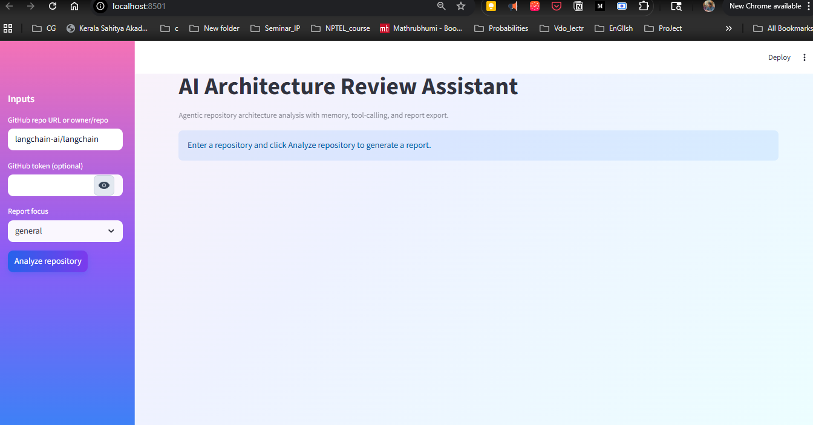
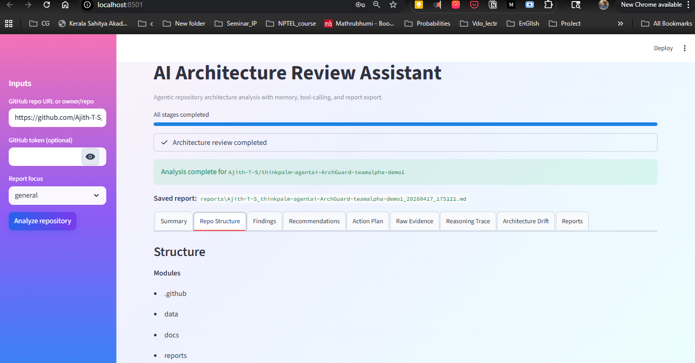
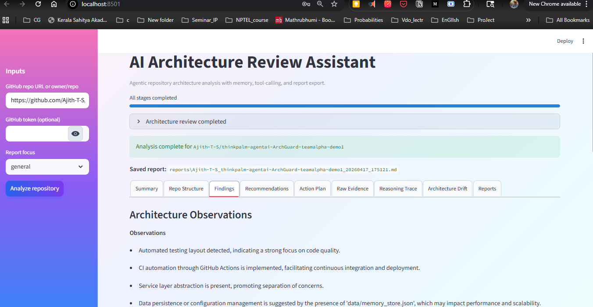
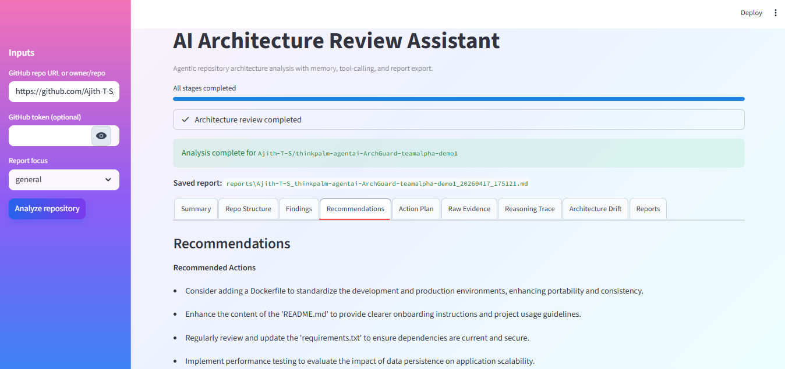
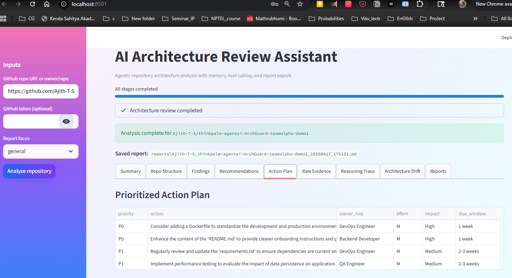
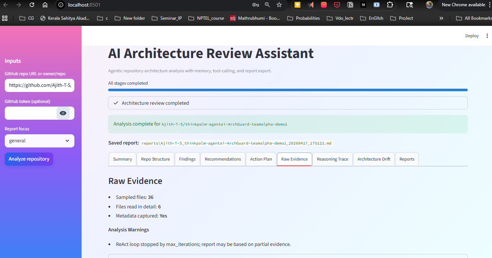
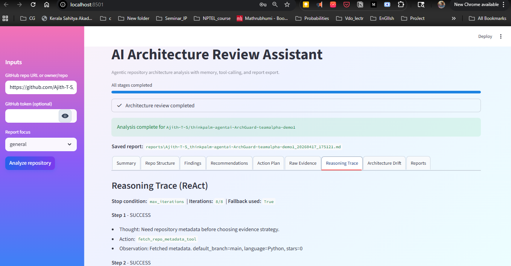
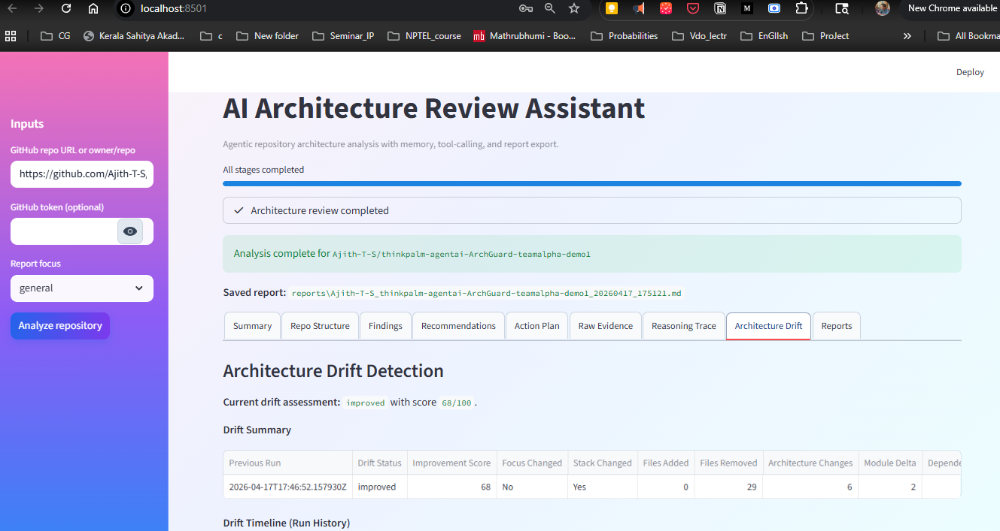
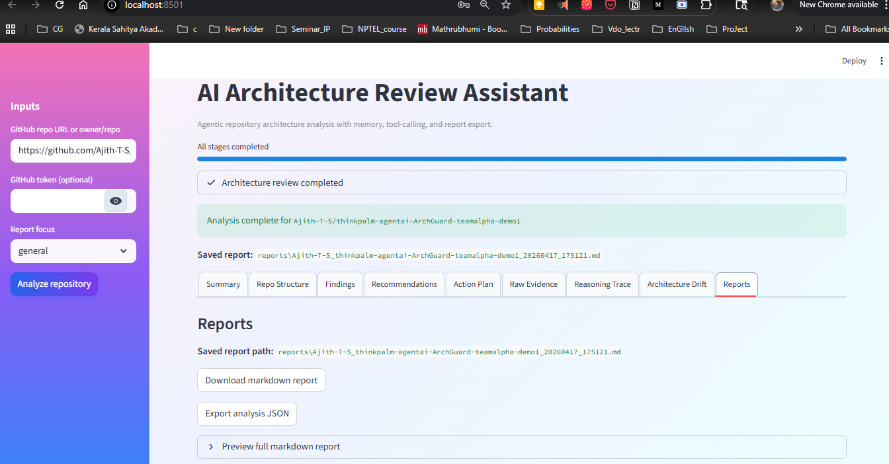

# AI Architecture Review Assistant

**Project name:** ArchGuard AI

**Author (sole team member):** AJITH T S — Tech Lead

**Contributions & responsibilities:** Product direction and scope; multi-agent pipeline (repo analysis, architecture review, report writer) with LangChain tool-calling; GitHub integration and JSON memory/drift logic; Streamlit UI and Typer CLI; quality gates (tests, lint/format, CI); documentation, demo assets, and submission materials.

AI Architecture Review Assistant is an end-to-end, agentic mini project that ingests a GitHub repository and generates a structured architecture review report with practical recommendations.

**What it does:** Ingests a GitHub repository, analyzes architecture signals, and produces a structured review that is demo-friendly and easy to run.

## Tech stack (versions)

| Layer | Technology | Version |
| --- | --- | --- |
| Runtime | Python | 3.11 (used in CI; local 3.11+ recommended) |
| UI | Streamlit | ≥ 1.33.0 |
| LLM orchestration | LangChain | ≥ 0.2.11 |
|  | langchain-core | ≥ 0.2.24 |
|  | langchain-openai | ≥ 0.1.17 |
| LLM API | OpenAI Python SDK | ≥ 1.40.0 |
| Data / config | Pydantic | ≥ 2.7.0 |
|  | python-dotenv | ≥ 1.0.1 |
| HTTP | requests | ≥ 2.32.0 |
| CLI | Typer | ≥ 0.12.3 |
|  | Rich | ≥ 13.7.1 |
| Tabular UI | pandas | ≥ 2.2.0 |
| Tests | pytest | ≥ 8.2.0 |
| Dev quality | Black | ≥ 24.4.0 |
|  | Ruff | ≥ 0.5.0 |

Default LLM model is configurable via `.env` (`OPENAI_MODEL`, commonly `gpt-4o-mini`). Exact installed versions depend on your environment; use `pip freeze` after `pip install -r requirements.txt` to pin a full lockfile if needed.

## Project overview
The app analyzes repository metadata, file structure, dependency manifests, and key config signals. It then uses multiple agents to produce a review report covering architecture observations, risks, and next steps.

## Features
- End-to-end architecture analysis from GitHub URL or `owner/repo`
- Multi-agent pipeline:
  - Repository Analysis Agent
  - Architecture Review Agent
  - Report Writer Agent
- LangChain tool-calling for GitHub + analysis + memory operations
- Memory with JSON persistence:
  - stores previous analysis by repo
  - stores run-by-run history for trend analysis
  - remembers focus preference (report depth defaults to deep)
  - compares current vs previous run for architecture drift
- Explicit ReAct-style evidence loop:
  - Thought -> Action -> Observation steps
  - max-iteration guardrails and stop conditions
  - per-step reasoning trace shown in UI and CLI
- Polished UX:
  - stage progress tracker with status updates
  - metrics cards (files scanned, dependencies found, risks, confidence)
  - evidence-backed findings with file snippets
- Standout features:
  - Drift Timeline (multi-run trend in drift tab)
  - Prioritized Action Plan (P0/P1/P2 with owner, effort, impact, due window)
- Streamlit UI with report sections and markdown download
- CLI mode for terminal workflows

## Architecture flow
User -> Streamlit UI / CLI -> Orchestrator -> Repo Analysis Agent + Tools + Memory -> Architecture Review Agent -> Report Writer Agent -> Markdown Report + UI output

## ReAct loop and drift detection

### ReAct evidence collection loop
The Repository Analysis Agent executes a bounded loop with visible steps:
1. **Thought**: decide the next information gap
2. **Action**: call one tool (`fetch_repo_metadata`, `list_repo_files`, `read_repo_file`)
3. **Observation**: capture what was learned
4. repeat until enough evidence or guardrail stop

Guardrails:
- `MAX_REACT_ITERATIONS` (default `8`)
- stop conditions: `enough_evidence`, `api_error`, `rate_limit`, `max_iterations`
- fallback mode when the loop exits early (partial evidence warning is attached)

Where visible:
- Streamlit tab: **Reasoning Trace**
- CLI output: ReAct summary + recent reasoning steps
- Markdown report: `Reasoning Trace (ReAct)` section

### Architecture drift detection between runs
Each run stores summary metrics in `data/memory_store.json` keyed by `owner/repo`, then compares the new run with the previous one.

Drift output includes:
- `new_risks` and `resolved_risks`
- `risk_delta`, `module_delta`, `dependency_delta`
- `stack_changed`
- `pattern_changes` (`added`/`removed`)
- `drift_status` (`improved`, `stable`, `regressed`)
- `improvement_score` (0-100)

Where visible:
- Streamlit tab: **Architecture Drift**
- CLI output: drift status and score

### Observability and evaluation visibility
To make evaluation straightforward:
- ReAct step traces are stored in each analysis result (`reasoning_trace`, `react_summary`)
- Streamlit exposes **Reasoning Trace**, **Architecture Drift**, **Action Plan**, and **Reports** tabs
- CLI prints ReAct stop condition, iteration usage, and recent tool steps
- Markdown report includes a `Reasoning Trace (ReAct)` section

## Documentation assets
Project documentation assets in `docs/`:
- `architecture_decision_doc.md`
- `demo_script_outline.md`
- `architecture_diagram.md` (Mermaid architecture source)
- `architecture_diagram.mmd` (diagram source file for export tools)
- `architecture_diagram.png` (rendered image)
- `one_page_writeup.md` (submission-ready one-page summary)

If PNG/PDF is required, export `docs/architecture_diagram.md` Mermaid diagram to:
- `docs/architecture_diagram.png`

## Folder structure
```text
ai-architecture-review-assistant/
├── app.py
├── main.py
├── requirements.txt
├── .env.example
├── README.md
├── docs/
│   ├── architecture_decision_doc.md
│   ├── architecture_diagram.md
│   ├── architecture_diagram.mmd
│   ├── architecture_diagram.png
│   ├── one_page_writeup.md
│   └── demo_script_outline.md
├── src/
│   ├── agents/
│   │   ├── repo_analysis_agent.py
│   │   ├── architecture_review_agent.py
│   │   └── report_writer_agent.py
│   ├── tools/
│   │   ├── github_tools.py
│   │   ├── analysis_tools.py
│   │   └── memory_tools.py
│   ├── services/
│   │   ├── github_service.py
│   │   ├── llm_service.py
│   │   └── report_service.py
│   ├── memory/
│   │   └── memory_store.py
│   ├── models/
│   │   └── schemas.py
│   └── utils/
│       └── helpers.py
├── data/
│   └── memory_store.json
└── reports/
```

## Setup

### 1) Clone and create virtual environment
```bash
python -m venv .venv
```

Activate:

- Windows PowerShell:
```powershell
.venv\Scripts\Activate.ps1
```

- macOS/Linux:
```bash
source .venv/bin/activate
```

### 2) Install dependencies
```bash
pip install -r requirements.txt
```

### 3) Configure environment
```bash
copy .env.example .env
```
Update `.env` values:
- `OPENAI_API_KEY` (required)
- `OPENAI_MODEL` (default `gpt-4o-mini`)
- `GITHUB_TOKEN` (optional but recommended for higher limits/private repos)
- `MAX_FILES_TO_ANALYZE`
- `MAX_FILE_BYTES`
- `MAX_REACT_ITERATIONS` (default `8`)
- `TARGET_FILE_READS` (default `12`)
- `DEFAULT_REPORT_FOCUS`
- `DEFAULT_REPORT_DEPTH` (default `deep`)

## Run Streamlit app (preferred)
```bash
streamlit run app.py
```

UI supports:
- repo URL/owner-repo input
- optional GitHub token
- focus dropdown
- fixed report depth (`deep`)
- section tabs for summary, structure, findings, recommendations, action plan, raw evidence, reasoning trace, architecture drift, reports
- markdown + JSON export
- run history panel (current repo and cross-repo)

## Screenshots

Streamlit UI (`streamlit run app.py`): landing view first, then result tabs in the same order as the app.

### Landing



### Summary


### Repo Structure



### Findings



### Recommendations



### Action Plan



### Raw Evidence



### Reasoning Trace



### Architecture Drift



### Reports



## Run CLI
```bash
python main.py analyze langchain-ai/langchain --focus maintainability
```

Optional token override:
```bash
python main.py analyze microsoft/vscode --github-token <token>
```

## Quality and reliability checks
- Unit tests cover:
  - repo input parsing
  - dependency parsing
  - memory store read/write/compare behavior
- Integration smoke test validates the end-to-end pipeline using mocked GitHub API responses and mocked LLM output.
- Make targets:
  - `make test`
  - `make lint`
  - `make format`
  - `make run-ui`
  - `make run-cli`
- CI workflow is available at `.github/workflows/ci.yml` and runs lint + tests on pushes and pull requests.

## Sample input and output

### Sample input
- Repo: `https://github.com/streamlit/streamlit`
- Focus: `scalability`
- Depth: `deep` (default)

### Sample output sections
- Project overview
- Detected stack
- Module breakdown
- Architecture observations
- Risks / anti-patterns
- Recommendations
- Prioritized action plan
- Suggested next steps
- Raw evidence
- Drift timeline and architecture-level changes

Generated markdown report is saved under `reports/`.


## Safeguards included
- Limits files analyzed and file size to control token cost
- Skips likely binary/large generated files
- Handles missing/invalid token cases
- Handles GitHub API errors and rate-limit style failures
- Supports private repos when token permissions allow

## Limitations
- Static repository scan cannot fully validate runtime behavior
- Dependency parsing is heuristic for common manifest formats
- Very large monorepos may need higher limits or scoped analysis
- LLM output can vary by model and prompt behavior
- Drift scoring is heuristic and should be treated as directional guidance
- JSON memory is lightweight and practical, but less scalable than DB/vector-backed memory

## Future improvements
- Add richer diff-based comparisons across commits
- Add pluggable analyzers for security/performance metrics
- Add async retrieval and caching
- Add Claude provider integration path in `llm_service`
